# Creating a Marketplace Workflow Action

Source: https://marketplace.gohighlevel.com/docs/marketplace-modules/CustomActions

Screenshot: images/marketplace-modules_CustomActions_screenshot.png

## Images

- 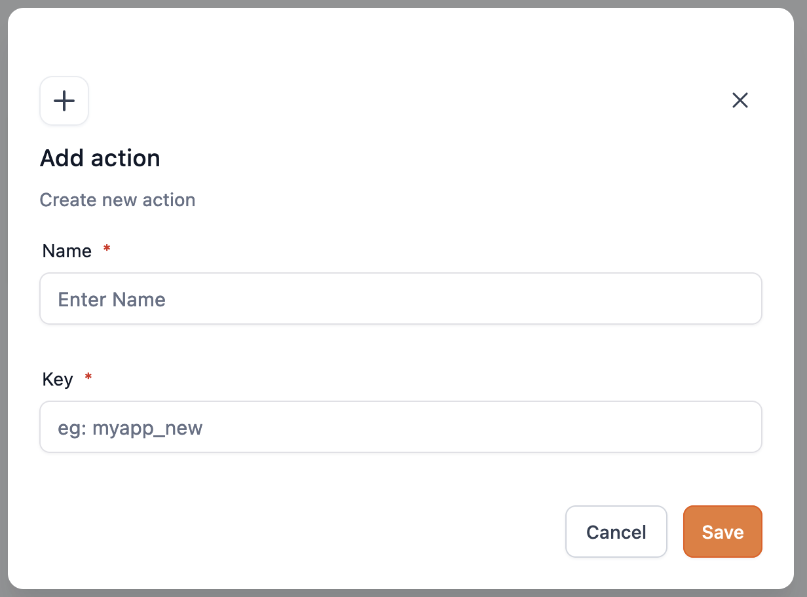 (1232x912, 71.2KB)
- 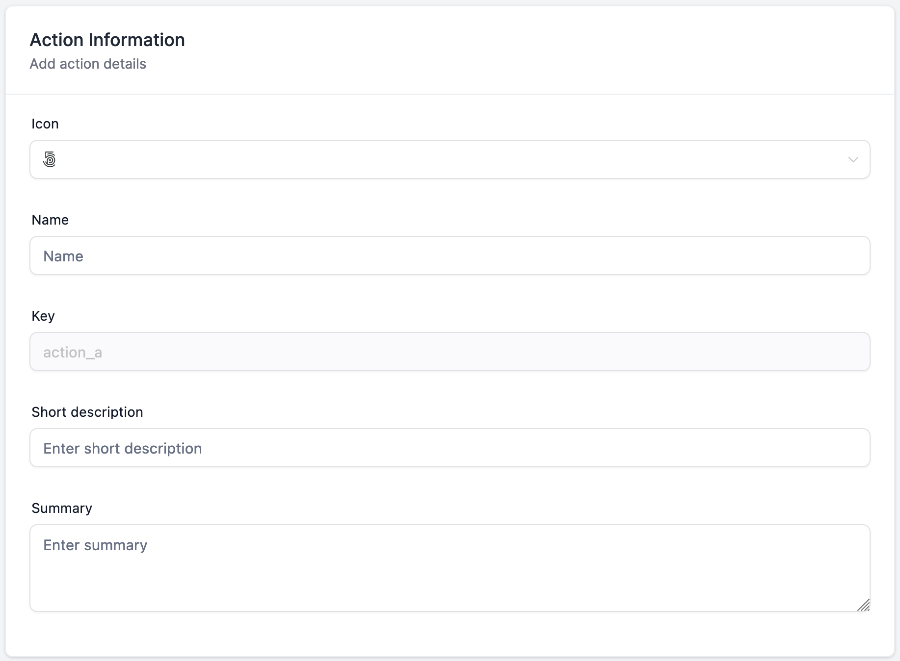 (1834x1348, 111.7KB)
- 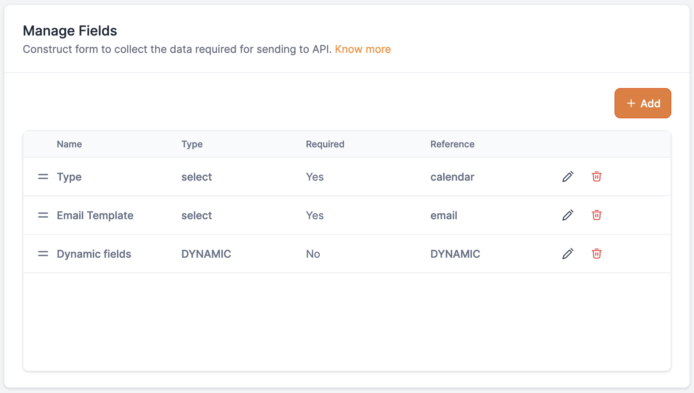 (1834x1040, 115.8KB)
- 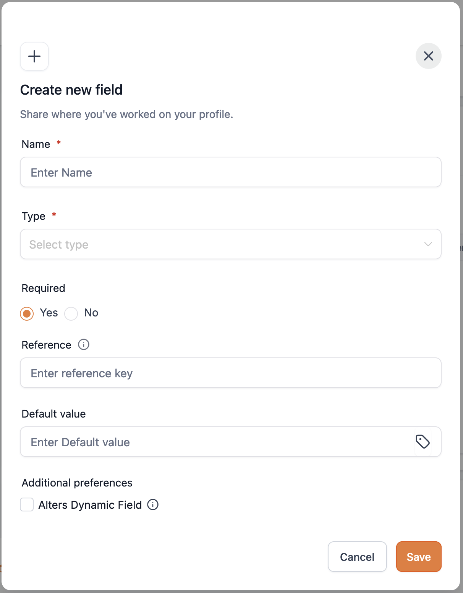 (1212x1548, 138.3KB)
- 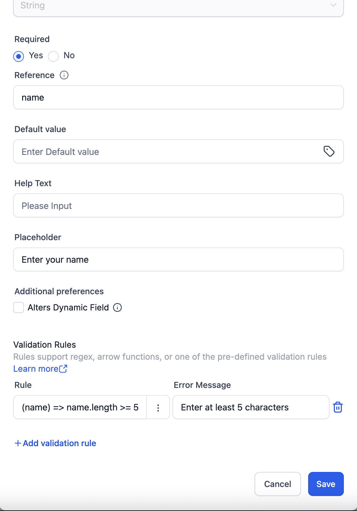 (1192x1702, 152.4KB)
- 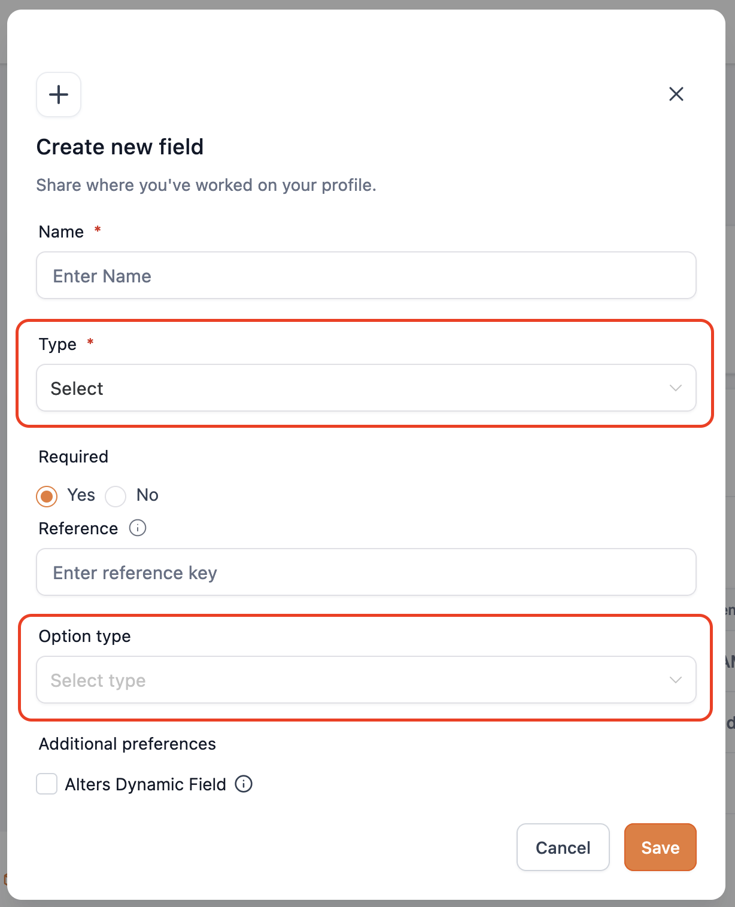 (1228x1516, 131.0KB)
- 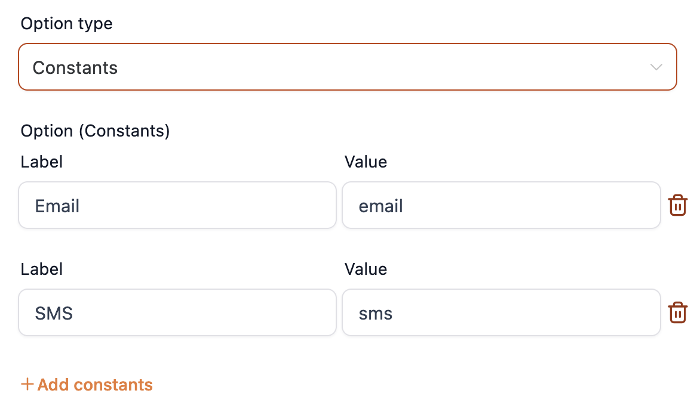 (1172x686, 63.1KB)
- 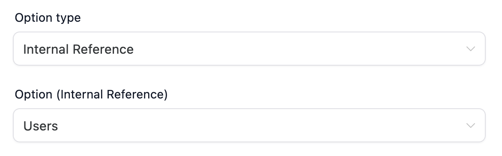 (1172x366, 34.7KB)
- 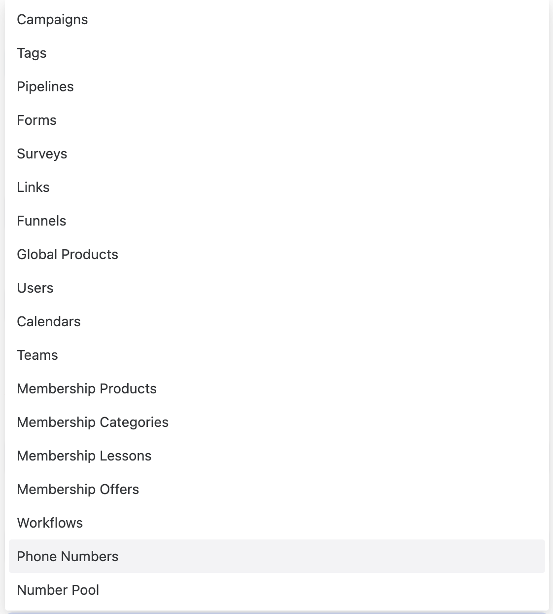 (1122x1244, 101.2KB)
- 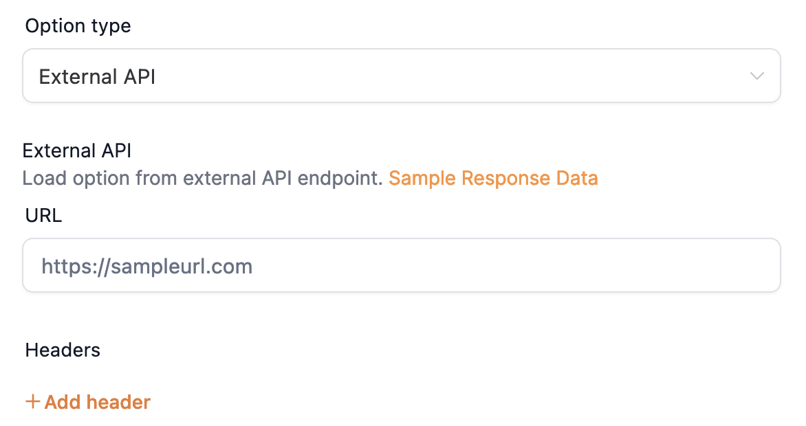 (1172x620, 64.3KB)
- 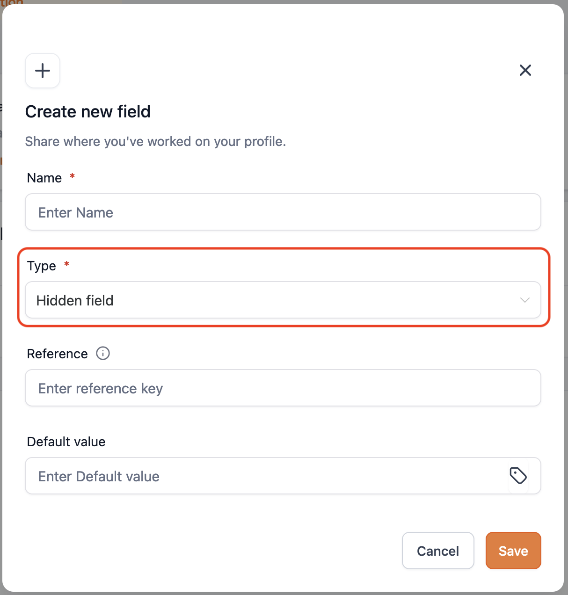 (1214x1272, 105.3KB)
- 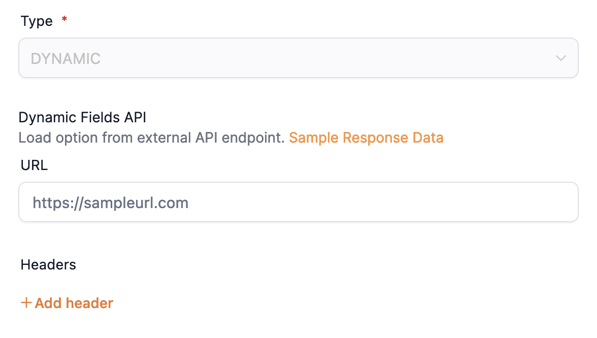 (1176x666, 65.4KB)
- 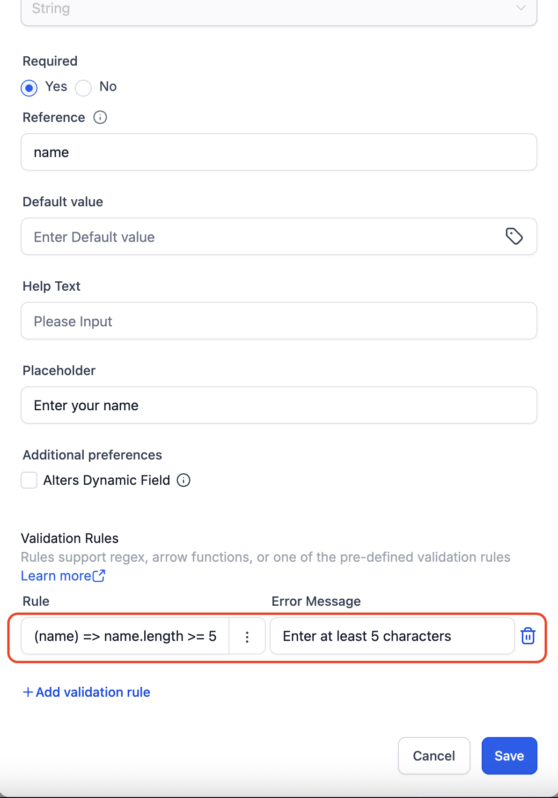 (1192x1702, 187.7KB)
- 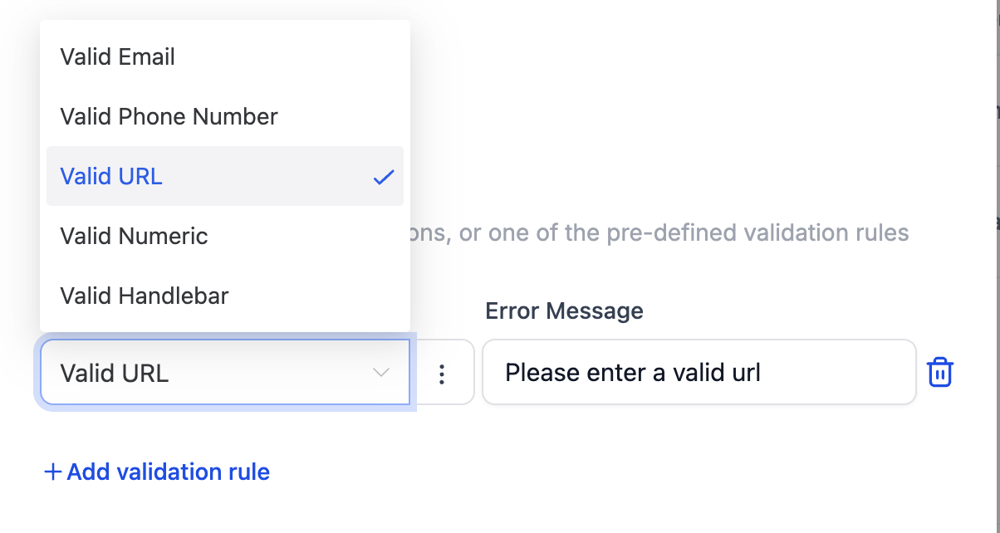 (1204x642, 68.1KB)
- 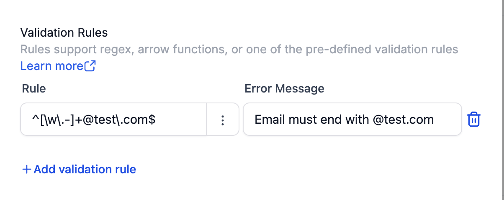 (1204x480, 55.1KB)

---

Marketplace ModulesWorkflow Actions and TriggersMarketplace Workflow Actions
Creating a Marketplace Workflow Action
Marketplace Workflow Actions are the customizable workflow actions managed in Marketplace. You will be able to create custom actions to push or pull data from your application/API in a workflow using customized fields and API endpoint.
Create a New Action
Navigate to the "Workflow" section, located under the Modules in the left-hand navigation menu of your app..
Click on "Create Action" to initiate the process.
Define Action Information
Name: Provide a descriptive name for your action.

Key: Assign a unique identifier (e.g., mycustomaction). This key is immutable and used to reference the action within workflows.
Icon: Select an icon to represent the action visually in the workflow builder.
Short Description: Write a brief explanation of what the action does.
Summary: Provide detailed information about the action's functionality and use cases.

Action Configuration
Manage Fields
Construct form to collect the data required for sending to API

Create New Field

Name
Enter Field Name
Type
Select one of the following field types:
String, Numerical, Textarea, Select, Multiple Select, Radio, Toggle, Checkbox, Attachment, Rich Text Editor, Hidden, Dynamic
Required
Enable if this is a required field in workflow.
Reference
Enter unique reference key. The value of this field will be bind to the provided key. Example: action_a_name
Default Value
Enter or map a value. The value provided will be used as default value for this field when loaded in workflow.
Alters Dynamic Field
If enabled, any changes made to this field value will trigger/ re-trigger loading the dynamic fields to the workflow action configuration UI.
Validation Rules Validation Rules let you protect data quality by checking the value a user types into a form field, table cell, or configuration input before it is saved or passed downstream.
If the value fails the check, HighLevel blocks the save/submit action and shows a custom error message that you configure.
Typical use-cases
Scenario Example
Lead-capture form Require a properly-formatted US phone number
Web-hook payload Ensure a “status” field matches one of allowed strings
Custom action param Block users from entering Handlebar syntax in plain text
Field Types: Select / Multi Select / Radio

Option Type is applicable only for Select, Multi Select and Radio field types.
Select one of the following option types:
Constants
Load options by adding custom Label-Value constants

Internal Reference
Load options from HighLevel Internal Modules

Supported HighLevel Modules

External API
Load option from external API endpoint

URL (GET)
Provide a URL to support GET method and send a valid response as per the sample response structure shared below.
Headers
Add headers as per your requirement
Sample Response Data
{
  "options": [
    { "label": "Afghanistan", "value": "AF" },
    { "label": "Åland Islands", "value": "AX" },
    { "label": "Albania", "value": "AL" },
    { "label": "Algeria", "value": "DZ" },
    { "label": "American Samoa", "value": "AS" }
  ]
}
Field Type: Hidden
It will be hidden in the action configuration and the mapped data will be sent in the payload. Used to collect essential information such as company_id, customerid, etc., from system data or from your custom triggers.

Field Type: Dynamic
Dynamic fields are used to build custom fields from an API call. The API call should return the below response structure to construct the fields in the Workflow action configuration form UI. Only one Dynamic type can be created per action.

URL (POST)
Enter your API endpoint URL. When executed data is sent to this API endpoint via POST method.
Headers
Add headers as per your requirement
Sample Payload:
{
  "data": {
    "name": "John Doe",
    "age": "29",
    "gender": "male",
    "hobbies": ["sports", "music"],
    "address": "My Address",
    "country": "US",
    "profileType": "public",
    "dataShare": true,
    "tems": true
  },
  "extras": {
    "locationId": "xyz",
    "contactId": "abc",
    "workflowId": "def"
  },
  "meta": {
    "key": "custom_action_key",
    "version": "1.0"
  }
}
Sample Response Structure:
Sections are used to group the fields in UI
{
  "inputs": [
    {
      "section": "Personal Info",
      "fields": [
        { "field": "name", "title": "Name", "fieldType": "string", "required": true },
        { "field": "age", "title": "Age", "fieldType": "numerical", "required": true },
        { "field": "gender", "title": "Gender", "fieldType": "select", "required": true,
          "options": [
            { "label": "Male", "value": "male" },
            { "label": "Female", "value": "female" }
          ]
        }
      ]
    },
    {
      "section": "Location Info",
      "fields": [
        { "field": "village", "title": "Village", "fieldType": "string", "required": true },
        { "field": "city", "title": "City", "fieldType": "string", "required": true },
        { "field": "fullAddress", "title": "Your Full Address", "fieldType": "textarea", "required": true }
      ]
    }
  ]
}
Sample structure for each Field Types
String
{ "field": "name", "title": "Name", "fieldType": "string", "required": true }
Numeric
{ "field": "name", "title": "Name", "fieldType": "numeric", "required": true }
Textarea
{ "field": "description", "title": "Description", "fieldType": "textarea", "required": true }
Select
{
  "field": "gender",
  "title": "Gender",
  "fieldType": "select",
  "required": true,
  "options": [
    { "label": "Male", "value": "male" },
    { "label": "Female", "value": "female" }
  ]
}
Multiple Select
{
  "field": "hobbies",
  "title": "Hobbies",
  "fieldType": "multiselect",
  "required": true,
  "options": [
    { "label": "Sport", "value": "sport" },
    { "label": "Music", "value": "music" }
  ]
}
Radio
{
  "field": "profileType",
  "title": "Profile Type",
  "fieldType": "radio",
  "required": true,
  "options": [
    { "label": "Public", "value": "public" },
    { "label": "Private", "value": "private" }
  ]
}
Toggle
{ "field": "dataShare", "title": "Allow my data to be stored", "fieldType": "toggle", "required": true }
Checkbox
{ "field": "terms", "title": "Terms & conditions", "fieldType": "checkbox", "required": true }
Validation Rules (Types)
The Validation Rules feature helps app developers ensure data integrity by enforcing input checks on form fields. Developers can choose from three flexible validation methods:

Pre-defined Rules
Easily apply common validations such as email, phone number, URL, numerical values, and handlebar syntax checks.

Regex Support
Use custom regular expressions to validate inputs against specific patterns.

Arrow Function
Write custom arrow functions that receive the input value and return true or false based on whether the validation passes or fails.

For every validation rule, a custom error message must be provided to display meaningful feedback when validation fails.
Multi-branch
The Multi-Branch Feature enables the creation of branches that can dynamically adjust based on various predefined conditions. By allowing multiple branches within a workflow, each contact can be directed down the appropriate path based on their interactions or status.
Branch Section: Defines the name or identifier for the specific branch section.
Branch Section Description: Provides a brief description or details about the branch section.
Branch Name Label: Specifies the label that will be displayed for the branch name.
Branch Name Helptext: Offers additional information related to the branch name.
Delete Branch Title: Sets the title or label used when deleting a branch.
Delete Branch Description: Describes when a branch is deleted.
Options:
Allow New Branches: Enables users to add new branches within the action.
Is Predefined Branches Editable: Allows users to edit predefined branches within the action.
Show Branches Section: Displays the branch section details to the user.
Disabled Allow new branch
Sample payload for branches
{
  "data": {
    "name": "John Doe",
    "age": "29",
    "gender": "male",
    "hobbies": [ "sports", "music" ],
    "address": "My Address",
    "country": "US",
    "profileType": "public",
    "dataShare": true,
    "tems": true,
    "branches": [
      {
        "id": "a8d14b13-d7cc-4241-bd2c-53180f0ec278",
        "name": "Branch name",
        "fields": {
          "branchFieldKey": "branchFieldValue"
        }
      }
    ]
  },
  "extras": {
    "locationId": "xyz",
    "contactId": "abc",
    "workflowId": "def"
  },
  "meta": {
    "key": "custom_action_key",
    "version": "1.0"
  }
}
Action Execution
Allows you to choose between an API or a custom code.
API
URL (POST)
Enter your API endpoint URL. When this action is executed data is sent to this API endpoint via POST method.
Headers
Add required header data that has to be included while sending data to the API endpoint
Sample Payload:
{
  "data": {
    "name": "John Doe",
    "age": "29",
    "gender": "male",
    "hobbies": ["sports", "music"],
    "address": "My Address",
    "country": "US",
    "profileType": "public",
    "dataShare": true,
    "tems": true
  },
  "extras": {
    "locationId": "xyz",
    "contactId": "abc",
    "workflowId": "def"
  },
  "meta": {
    "key": "custom_action_key",
    "version": "1.0"
  }
}
Custom code
Custom Code allows users to create custom logic they want to achieve. This provides flexibility and control beyond the pre-built APIs, enabling users to automate complex tasks and integrate with various services not supported by API.
Code Editor
You can write the code in the Code Editor
You can input HTTP requests like Get, Put, Post, Delete etc via the button.
You can also use custom values using the picker.
Output should be a JavaScript Object or Array of Objects.
Test and format your Code
Testing the code is a mandatory step, if the test is not done then user will not be able to use the output of the code in the subsequent steps.
To test the code click on the "Test Code" button.
Post clicking on Run test button, if there are no errors in the code them it will show "Test Result Success" and if there is an error in code then the result will be "Test Result Failed" and you would have to recheck the code to remove the error.
You can also format the code using "Format code" button.
Pause Execution
This toggle is used the contact will be held at this action unless resume webhook is requested.
If this toggle is true then provided extras object needs to be passed as body payload for resume workflow endpoint.
Show API details button shows a sample response to be passed onto to the webhook for Success Execution and Failed Execution.
Sync: When the pause execution is turned off along with branching support, the contact will be moved to provided branch using branchId property from API response or from Custom Code using return statement. The branchId here will be the branch through with the contact will move forward.
Async: When the pause execution is turned off, the branch ID needs to be sent to the webhook for resuming which is present in "show API details" button. More info present in Pause functionality.
Response Data
Add sample response data to configure custom variables.
Enter a valid sample response JSON structure that will be sent as a response to the Send Data API endpoint.
Arrays are supported in response data. This data can be utilized in custom variables based on references and is available for use in Array Functions, Custom Code, and Custom Webhooks.
Manage Custom Variables
Add Custom variables using sample response data, for users to use in workflows.

Add Custom Variable

Name
Enter label name
Reference
Select a reference key from the sample response saved to Response Data.
Submit for Review

The action version will be in draft state by default. After updating the action information and configuration the action version should be submitted for review.
Click on Submit for review and add required changelog information for the submitted version.

Once approved the version submitted for review will be published live to all Sub-accounts.

Create New Version
Click on + New Version to create a new version for the action.

On clicking + New Version It will create a new draft version with all the previously published data prefilled.

Delete Action
Once an Action is deleted, it will be deleted permanently and cannot be restored. The deleted action will be removed from Marketplace App and Workflow Action list. If a deleted action is part of any workflow the action execution will be skipped.

Enter action name to confirm delete

For more detailed information, refer to the official HighLevel guide on Marketplace Workflow Actions.