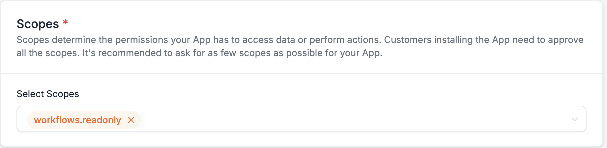

# HighLevel Marketplace Workflow Triggers & Actions

Source: https://marketplace.gohighlevel.com/docs/marketplace-modules/WorkflowActionsAndTriggers

Screenshot: images/marketplace-modules_WorkflowActionsAndTriggers_screenshot.png

## Images

-  (1836x448, 78.5KB)

---

Marketplace ModulesWorkflow Actions and Triggers
HighLevel Marketplace Workflow Triggers & Actions
HighLevel's Marketplace empowers developers to create custom Workflow Triggers and Workflow Actions, facilitating seamless integration with external applications and APIs. These tools are part of the LC Premium Triggers & Actions suite, which operates on a pay-per-execution model.
Prerequisites
Before creating a Marketplace Workflow Trigger or Action:
Create a Developer Account: Sign up/ Sign in to Marketplace to create/manage Marketplace Workflow Triggers & Actions.
Enable Required Scope: Ensure the workflows.readonly scope is activated to access actions and triggers.

Note Marketplace Workflow Actions are part of LC Premium Triggers & Actions and are chargeable per execution.
How to enable and rebill LC Premium Triggers & Actions for Workflows?
You should enable Workflow LC Premium Triggers & Actions for the sub-account to access the Actions created in the Marketplace App.
The marketplace workflow actions created in an APP will be listed in the workflow actions only if the sub-account has the APP installed/integrated from the Marketplace.