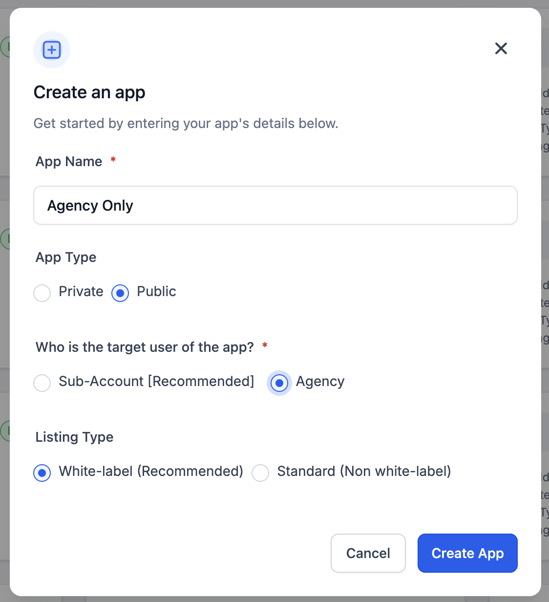
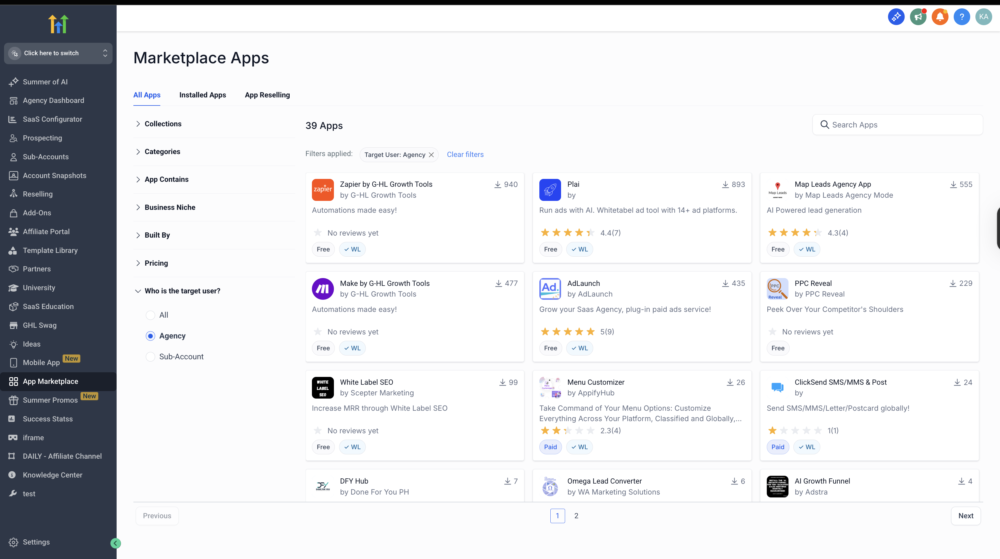
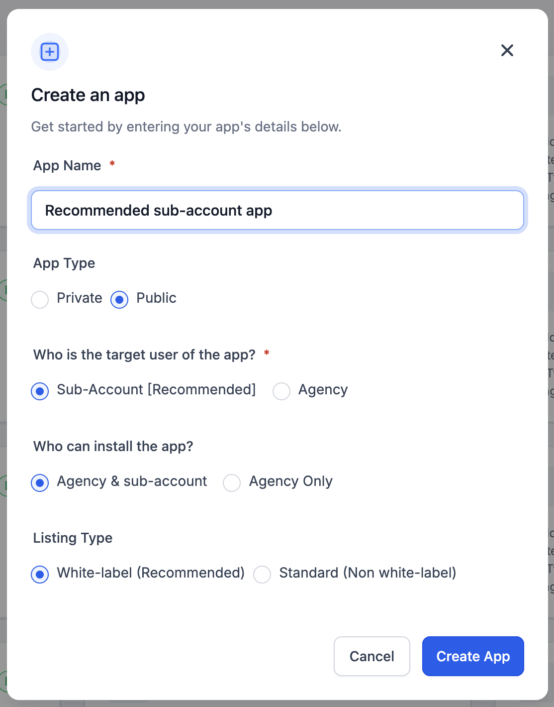
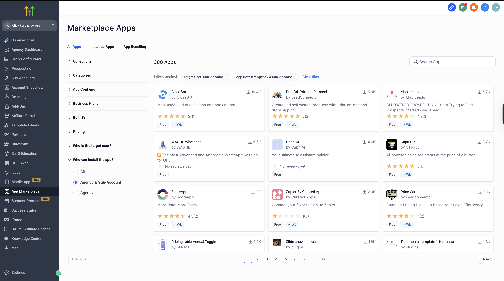
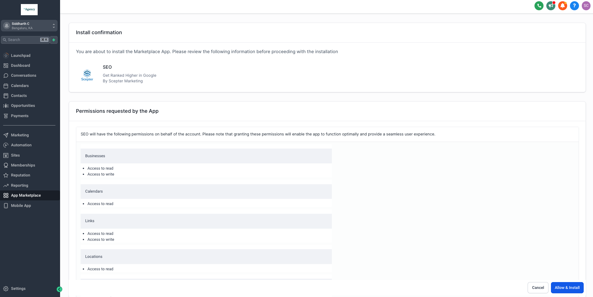
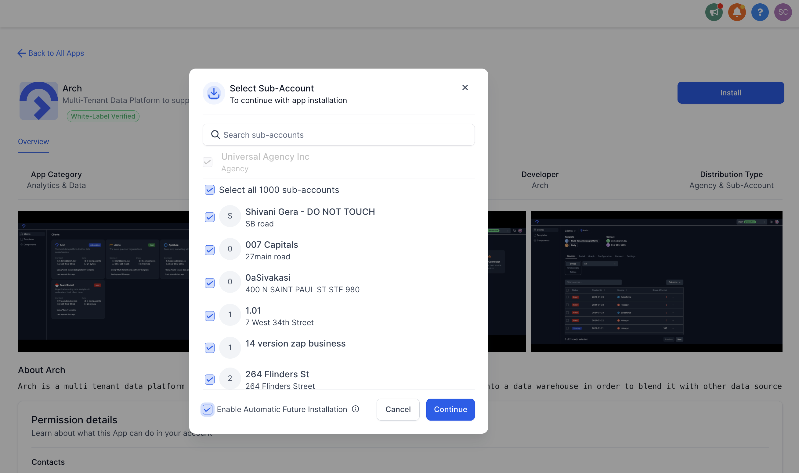
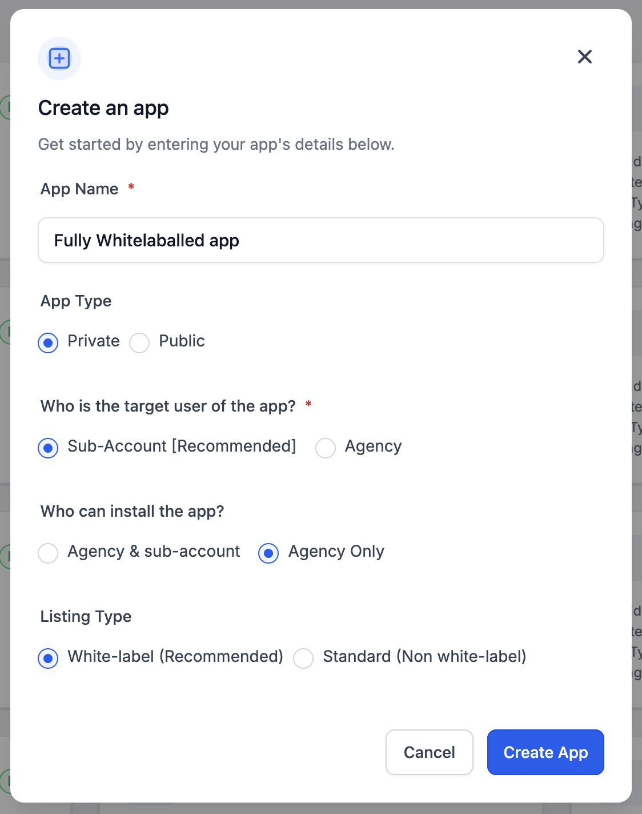
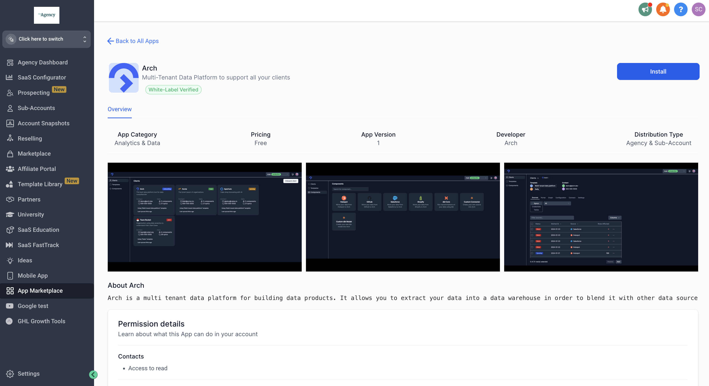

# Marketplace App Distribution Model

Source: https://marketplace.gohighlevel.com/docs/oauth/AppDistribution

Screenshot: images/oauth_AppDistribution_screenshot.png

## Images

-  (1124x1232, 133.1KB)
-  (3456x1934, 678.6KB)
-  (1114x1420, 157.8KB)
-  (3456x1926, 688.0KB)
-  (1905x956, 137.4KB)
-  (2618x1552, 469.7KB)
-  (1124x1424, 158.8KB)
-  (3008x1642, 518.7KB)
-  (2618x1552, 469.7KB)

---

Getting StartedApp Distribution
Marketplace App Distribution Model
This guide covers the new, simplified Marketplace distribution model and the OAuth flow you’ll need to implement to obtain the correct access tokens.
App Distribution Model
To configure your desired app distribution model, you have three fields:
Field Values Description
Who is the target user of the app? Agency / Sub-account Who is going to interact with the app? In other words, whose access token does the app ultimately need? For most apps, this will be Sub-account (Recommended). Note: This field cannot be modified once set.
Who can install the app? Both Agency and Sub-account / Agency Only Which user(s) may see and install the app from the Marketplace UI? Recommended: “Both Agency & Sub-account” for maximum reach. Use "Agency Only" for fully white-labelled SaaS features only agencies can discover and install.
Can this app be bulk-installed by agencies? Yes / No Primarily for backwards compatibility. All new Marketplace apps will be set to Yes (mandatory). Allows agency owners/admins to install to multiple sub-accounts in one operation. Cannot revert to No once set.
Distribution Scenarios
Developer’s distribution config scenarios and getting the right access token
Who is the target user? Who can install the app? Can the app be bulk-installed by agencies? User Installation Scenarios Access Token Details Step 2
Agency N/A N/A Agency user installs the app “isBulkInstallation” : false, “userType” : ”Company” N/A
Sub-account Agency & sub-account No Sub-account user installs the app “isBulkInstallation” : false, “userType” : ”Location” N/A
Sub-account Agency & sub-account No Agency user installs the app “isBulkInstallation” : false, “userType" : "Location” N/A
Sub-account Agency & sub-account Yes Sub-account user installs the app “isBulkInstallation” : false, “userType" : "Location” N/A
Sub-account Agency & sub-account Yes [NEW and RECOMMENDED] Agency user installs the app “isBulkInstallation” : true, “userType" : "Company” 1. Get sub-accounts where app is installed 2. Get Location Token using Agency Token for every location where app is installed 3. Listen to AppInstall webhook event for automatic future installations or installs done as part of a SaaS plan, and Get Location Token using Agency Token for the newly installed locations.
Sub-account Agency Only Yes Agency user installs the app “isBulkInstallation” : true, “userType" : "Company" 1. Get sub-accounts where app is installed 2. Get Location Token using Agency Token for every location where app is installed 3. Listen to AppInstall webhook event for automatic future installations or installs done as part of a SaaS plan, and Get Location Token using Agency Token for the newly installed locations.
Backward Compatibility
To maintain the existing installation flow for legacy apps, mappings are set as follows:
Legacy Distribution Type Target User Installer Bulk-install Recommendations
Agency Only Agency N/A N/A N/A
Sub-account Only Sub-account Agency & Sub-account No Develop the token exchange mechanism for bulk-installation flow as mentioned above. Once done, set "Can the app be bulk-installed by agencies?" to "Yes"
Agency & Sub-account Sub-account Agency Only Yes To make the app accessible to sub-accounts, you must ensure the app does not require any agency-level access such as: Agency Level Scopes - companies.readonly, companies.write, location.write, saas/location.write, snapshots.readonly, snapshots.write, custom-menu-link.readonly, custom-menu-link.write. Module > Snapshots, Module > CustomJS. If your app does not require any of the above: 1. Develop the OAuth flow for installation by sub-account admins, which would generate a userType: Location token, as mentioned above. 2. Once done, change "Who can install the app?" to "Agency & sub-account"
Target User Types
Target User: Agency
Choose this if your app is only relevant for agency-level accounts.

App Listing: Only in agency Marketplace.

Installation: Only agency admins/owners can install/uninstall.
Payments: Agency bears cost for paid apps.
Re-selling: Not available to sub-accounts.
Target User: Sub-account — Both Can Install
Choose this if your app is for sub-account-level usage but should be installable by both agencies and sub-accounts.

App Listing: Appears in both agency and sub-account Marketplaces.

Installation: Both sub-account admins and agency admins can install.

Bulk Installation: Supported if enabled. Agencies can auto-install to all sub-accounts.

Payments: Sub-account pays for paid apps.
Re-selling: Agencies can re-sell.
Target User: Sub-account — Only Agency Can Install
Choose this if only agencies should install, but app is used at sub-account level.

App Listing: Only in agency view.

Installation: Agency admins/owners install/uninstall for sub-accounts.
Bulk Installation: Supported if enabled.

Re-selling: Agencies can re-sell with markup.
Share your feedback
★
★
★
★
★