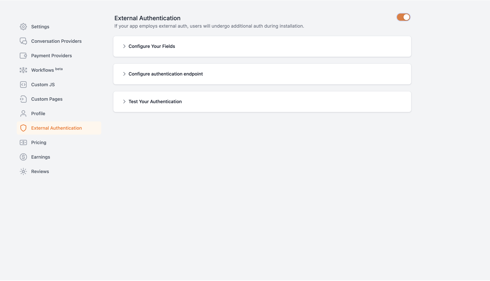
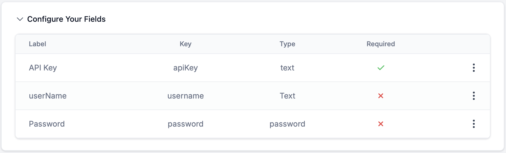
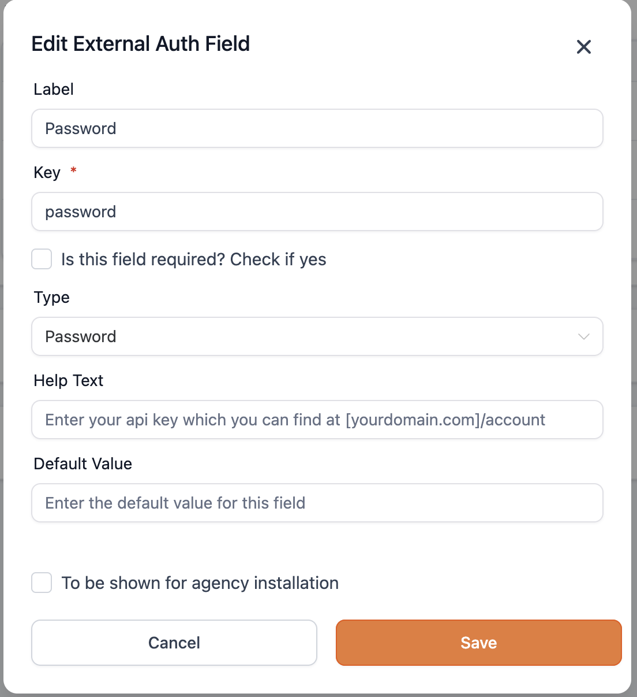
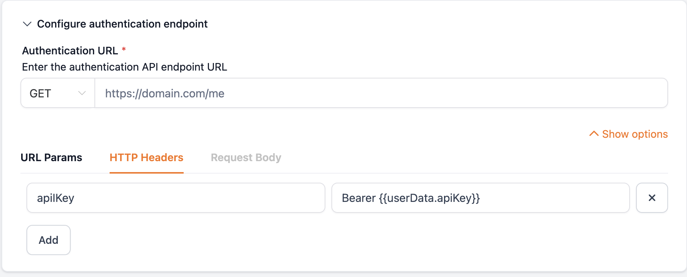
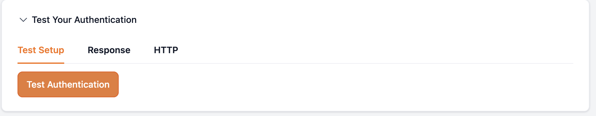
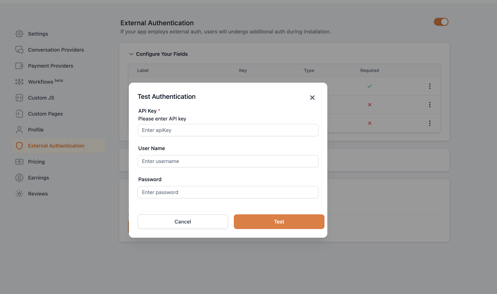
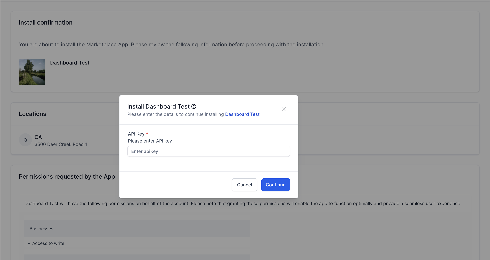
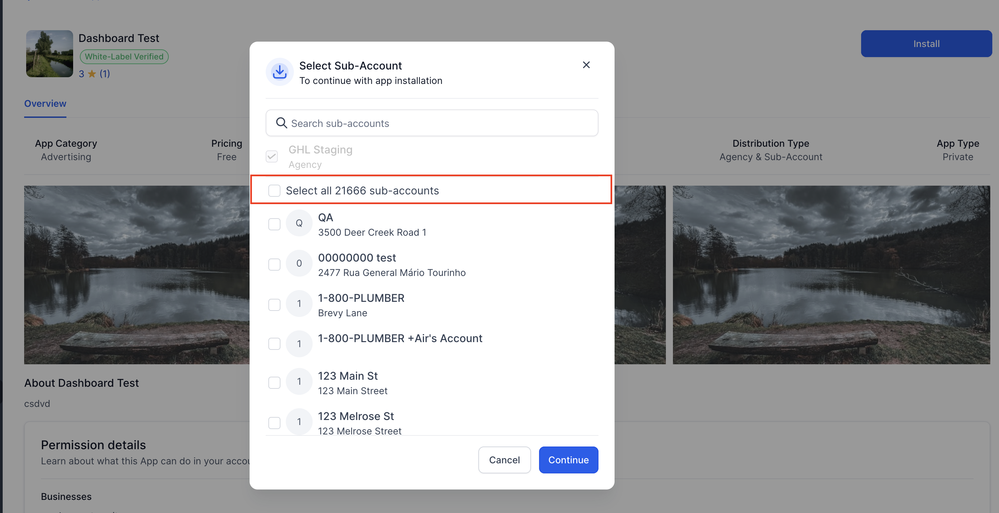

# External Authentication

Source: https://marketplace.gohighlevel.com/docs/oauth/ExternalAuthentication

Screenshot: images/oauth_ExternalAuthentication_screenshot.png

## Images

-  (2980x1708, 122.9KB)
-  (1824x556, 37.2KB)
-  (1104x1206, 86.3KB)
-  (1818x734, 66.1KB)
-  (1838x360, 24.7KB)
-  (2724x1618, 158.3KB)
-  (3010x1600, 218.1KB)
-  (2978x1528, 881.6KB)

---

External Authentication
External Authentication
External authentication enables developers to authenticate HighLevel users using their credentials with the developer’s system before installing the application on HighLevel.
This feature allows you to configure custom authentication fields as necessary, such as:
apiKey
username
password
oauth 2.0
How to enable external authentication on the application?
Navigate to Developer Marketplace > My Apps > select your app and click on 'External Authentication' tab in the navigation pane. We support API Key/Basic Auth and OAuth2.0
OAuth 2.0
Adding OAuth v2 Authentication to Marketplace Apps This document outlines the process of configuring OAuth 2.0 authentication for external calls within Marketplace apps. Currently, only the "Authorization Code" grant type is supported. HighLevel manages token pairs and includes them in custom actions and triggers, enabling a wide range of integration possibilities.
1. Configuration
Follow these steps to configure OAuth v2 authentication:
App Details and Scopes:
Provide the name of your third-party app, client key, and client secret. Specify the required scopes for your third-party integration. Separate scopes with spaces or commas. Include only the necessary scopes for the integration.
Redirect URL:
Copy the redirect URL provided in your Marketplace app configuration and paste it into your third-party app's configuration settings.
Authorization URL Configuration:
Configure the authorization URL. Marketplace pre-populates some standard fields, which you can adjust based on the third-party app's documentation. The state parameter is a standard OAuth2 security feature that prevents authorization requests from being initiated by unauthorized parties. Marketplace uses the state parameter to verify the validity of callback requests. Ensure this parameter is not modified for seamless integration.
PKCE (Proof Key for Code Exchange):
Enable PKCE for enhanced security during the OAuth authorization flow. When enabled:
A unique code verifier is generated for each authorization request
The code challenge (derived from code verifier) is included in the authorization request
The code verifier is securely stored and used during token exchange
Helps prevent authorization code interception attacks
Recommended for public clients and enhanced security
Access & Refresh Token Request Configuration:
Configure the access and refresh token request settings according to the third-party app's documentation. Marketplace pre-populates some standard configurations, which you can modify as needed. Click the "More Options" button to add any additional call details required.
Example Expected Response:
{
  "access_token": "your_access_token",
  "refresh_token": "your_refresh_token",
  "expires_in": 3600, // Example expiry time in seconds
}
When PKCE is enabled, the token request will automatically include the code_verifier parameter for verification.
Auto Refresh Token:
Enable the "Auto refresh token" option to automatically fetch new token pairs using the refresh API when tokens expire. If auto-refresh is disabled, the connection will break after token expiration. The user will need to re-authorize to re-establish the connection. We recommend to enable this option for smooth hustle free experience.
Test API:
Configure a test API endpoint (ideally a GET call requiring no special configuration) to validate the token. HighLevel will call this API to check token validity. If the test fails and auto-refresh is enabled, Marketplace will attempt to refresh the token. The access token is included by default in all API calls. If your API requires additional configuration for the test call, click the "More Options" button to add the necessary options.
Refresh Mechanism: The refresh mechanism is triggered only when a workflow with custom actions/triggers is about to execute. The access token is passed to all external calls involved in Marketplace custom action/trigger configurations.
Glossary
OAuth Parameters
The following table describes the essential OAuth parameters used in the authorization flow:
Parameter System Value Description
client_id {{externalApp.clientId}} Unique identifier issued by the third-party application. This ID is used to identify your application during the OAuth process.
client_secret {{externalApp.clientSecret}} A confidential key issued alongside the client_id. This secret key is used to authenticate your application when exchanging the authorization code for tokens. Must be kept secure and never exposed to clients.
scope {{externalApp.scope}} A space-separated list of permissions that your application requires to access the third-party application's resources. These scopes determine the level of access granted to your application.
response_type code Specifies the type of response expected from the authorization server. GHL exclusively supports the code response type, which returns an authorization code that can be exchanged for access and refresh tokens.
state {{bundle.state}} A security token generated by GHL to prevent CSRF attacks. This value must be returned unchanged in the callback response. The request will be rejected if the state parameter doesn't match the original value.
redirect_uri {{bundle.redirectUrl}} The callback URL where the third-party application will send the authorization response. This URL must be pre-registered and must match exactly with the URL provided during the OAuth configuration.
grant_type authorization_code or refresh_token Specifies the type of grant being requested from the authorization server:
- authorization_code: Used when exchanging the authorization code for access tokens
- refresh_token: Used when requesting new access tokens using a refresh token
code_challenge Generated value When PKCE is enabled, this parameter is included in the authorization request. It is derived from the code_verifier using SHA-256 hashing and base64URL encoding.
code_challenge_method S256 When PKCE is enabled, this parameter indicates the method used to generate the code challenge. Currently, only S256 (SHA-256) is supported.
code_verifier Generated value When PKCE is enabled, this parameter is included in the token request. It is a high-entropy cryptographic random string that was used to generate the code_challenge.
Token Parameters
These parameters are used during the OAuth token exchange process:
Parameter System Value Description
code {{bundle.code}} The authorization code received from the third-party application after successful authorization. This code is temporary and can only be used once to obtain access and refresh tokens.
access_token {{bundle.accessToken}} The token used to authenticate requests to the third-party API. This token has a limited lifetime and needs to be refreshed periodically.
refresh_token {{bundle.refreshToken}} A long-lived token used to obtain new access tokens when the current access token expires. This token remains valid until explicitly revoked.
2. Testing the Integration
Developers can test their configurations using the built-in test functionality. This initiates the OAuth process with the third-party app. Once the token is generated, the configured test API is called. Ensure all configurations are saved before testing.
Important Note: Switching between external authentication types (e.g., from Basic to OAuth) is currently not supported.[Coming soon]
API Key or Basic Auth

There are three sections available.

Section 1: Configure your fields This section contains all the fields that developers want to ask from users while installing the application.

To add a field to the user's authentication form, you may configure the following:
Label: It is a helpful text describing the field.
Key: The key that holds the value of the user's input. You may pass the user's input to your authentication endpoint in the header or body by using the key.
Type: The type of input shown to the user. Currently, two field types are supported: "text" and "password."
Required: Is the field required?
Help Text: A brief about the field that is displayed to the user. You can
Default field: Default value to be sent in case the user leaves the field empty.
NOTE: We currently support a maximum of three fields only.

Section 2: Configure authentication endpoint This section lets you configure the HTTP request template that would be made when a user tries to install the application.

Type of request: The request can be one of "GET", "POST", "PUT" or "PATCH" (When GET is selected, you will not be able to configure the request body) URL: It is the URL that would be hit with the request. URL params: The params that need to be sent with the request. HTTP headers: The headers that need to be sent with the request. Request Body: The body that needs to be sent with the request.
IMPORTANT NOTE:
You may need to pass the user-entered value, such as API Key/ Username / Password for authentication. You can easily access user input data from the userData object, which has the key of field and value entered by the users and can be accessed with {{userData.key}}. For example, if your field's key is 'apiKey', then you may access the user-entered value for the 'apiKey' using {{userData.apiKey}}.
For external auth verification to complete the authentication url should return one of the following status codes: 200, 201, 202, 204.

Section 3: Test your authentication
This section will allow developers to test the authentication flow with sample values.

Installation of the application At the time of installation, user would be asked to enter the fields that you have configured. Here's a sample authentication form displayed to the user at the time of installation.

External auth request parameters
Key Type Details
companyId string
This parameter is set to agencyId if the application was installed by an agency;
It will be null if the application was installed by a location
{field_key} string
Key: The key for the parameter is the key of the field.
There can be a maximum of three fields and hence three keys in the request parameter.
The value for the parmeters will be as per the agency user's response
approveAllLocations boolean
True - if "Select all N sub-accounts" checkbox was selected during installation
False - if "Select all N sub-accounts" checkbox was not selected during installation
locationId string[]
If approveAllLocations = false, this parameter contains an array of locationIds selected during installation
If approveAllLocation = true, this parameter is set to null.
excludedLocations string[]
If approveAllLocations = false, this parameter is set to null.
If approveAllLocation = true, this parameter contains an array of locationIds which were not selected during installation
NOTE:
In the POST, PATCH, and PUT requests, the above fields would be sent as part of the body
In the GET request, the fields would be passed as params
Examples:
Say an agency has 5 locations - A,B,C,D,E
Let's assume that the app requires two fields, "username" and "password".
Scenario 1: User selects location A while installing the app
{
"companyId": "123",
"locationId": {"A"},
"username" : "user1",
"password" : "password123",
"approveAllLocations": false,
"excludedLocations": null
}
Scenario 2: User selects locations A and B while installing the app
{
"companyId": "123",
"locationId": {"A","B"},
"username" : "user1",
"password" : "password123",
"approveAllLocations": false,
"excludedLocations": null
}

Scenario 3: User selects "Select all 5 locations"
{
"companyId": "123",
"locationId": null,
"username" : "user1",
"password" : "password123",
"approveAllLocations": true,
"excludedLocations": null
}

Scenario 4: User selects "Select all 5 locations", but unchecks location C and D
{
"companyId": "123",
"locationId": null,
"username" : "user1",
"password" : "password123",
"approveAllLocations": true,
"excludedLocations": {"C","D"}
}

Share your feedback
★
★
★
★
★