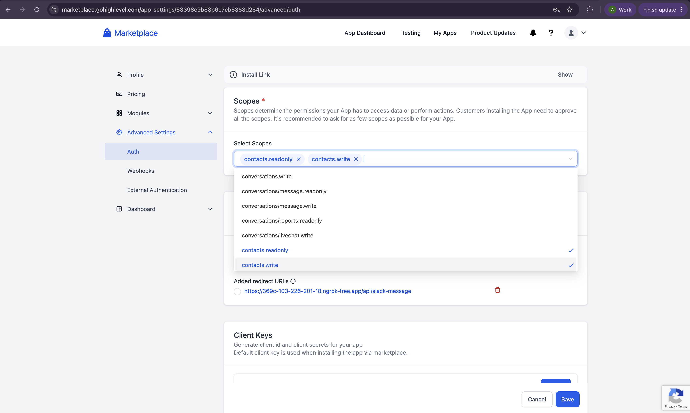
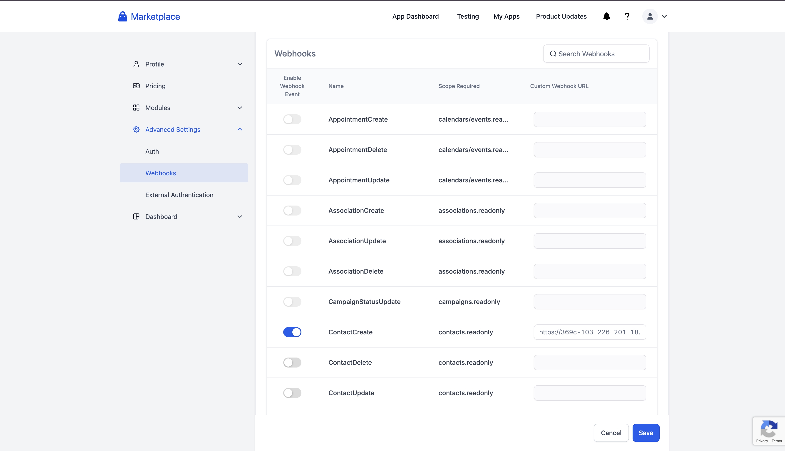
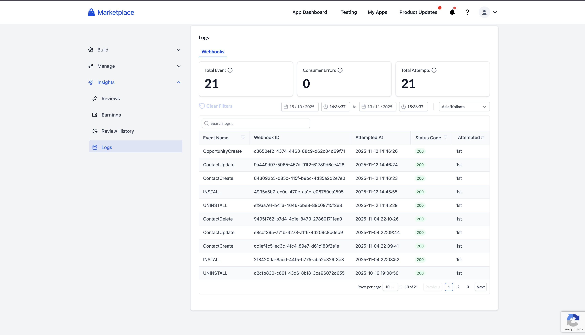

# Webhook Integration Guide

Source: https://marketplace.gohighlevel.com/docs/webhook/WebhookIntegrationGuide

Screenshot: images/webhook_WebhookIntegrationGuide_screenshot.png

## Images

-  (3452x2068, 489.9KB)
-  (3456x1988, 444.3KB)
-  (3456x1978, 528.8KB)

---

Webhook Integration Guide
Webhook Integration Guide
What are Webhooks?
Webhooks are a way for applications to communicate in real-time. Think of them as automatic notifications that are sent to your application when something happens in our platform.
Real-World Example
Imagine you're building an e-commerce app:
When a customer places an order → You get a webhook notification
When the order status changes → You get another webhook notification
When the payment is processed → You get yet another notification
This way, your app stays updated without constantly asking "has anything changed?"
Getting Started
Step 1: Create Your Webhook Endpoint
First, you need a public URL that can receive webhook notifications. Here are some options:
Option A: Use a Cloud Service
Heroku: Deploy a simple web app
AWS Lambda: Serverless function
Google Cloud Functions: Serverless function
Vercel: Easy deployment platform
Option B: Use a Webhook Testing Service
webhook.site: Get a temporary URL for testing
ngrok: Expose your local server to the internet
Option C: Use Your Own Server
Deploy a web application on your server
Ensure it's accessible via HTTPS
Step 2: Create a Simple Webhook Handler
Here's a basic example using Node.js and Express:
const express = require('express')
const app = express()

// Parse JSON requests
app.use(express.json())

// Your webhook endpoint
app.post('/webhooks', (req, res) => {
  console.log('Received webhook:', req.body)

  // Process the webhook data here
  const eventType = req.body.type
  const eventData = req.body.data

  // Handle different event types
  switch (eventType) {
    case 'ContactCreate':
      console.log('New contact created:', eventData)
      // Add your logic here
      break
    case 'ContactUpdate':
      console.log('Contact updated:', eventData)
      // Add your logic here
      break
    default:
      console.log('Unknown event type:', eventType)
  }

  // Always respond with 200 OK
  res.status(200).json({ success: true })
})

// Start your server
const PORT = process.env.PORT || 3000
app.listen(PORT, () => {
  console.log(`Webhook server running on port ${PORT}`)
})
Step 3: Test Your Endpoint
Before connecting to our platform, test your endpoint:
curl -X POST https://your-app.com/webhooks \
  -H "Content-Type: application/json" \
  -d '{
    "type": "ContactCreate",
    "timestamp": "2025-01-28T14:35:00.000Z",
    "webhookId": "test-123",
    "data": {
      "firstName": "John",
      "lastName": "Doe",
      "email": "john@example.com"
    }
  }'
Available Webhook Events
We offer a comprehensive set of webhook events that cover all major activities in our platform. Here's a quick overview of the main event categories:
Event Categories
Contact Events: Contact creation, updates, deletion, and tag changes
Opportunity Events: Opportunity lifecycle management and status updates
Task Events: Task creation, completion, and deletion
Appointment Events: Calendar appointment scheduling and updates
Invoice Events: Invoice lifecycle from creation to payment
Product Events: Product catalog management
Association Events: Relationship management between records
Location Events: Location creation and updates
User Events: User account management
And many more...
Detailed Event Documentation
For complete details about each webhook event, including:
Exact payload structure for each event
Field descriptions and data types
Sample JSON responses
Event-specific examples
📖 View Complete Webhook Documentation →
This detailed documentation provides comprehensive information about every available webhook event, including exact payload structures, field descriptions, and real-world examples.
Security: Verifying Webhook Authenticity
Why Verification is Important
Webhooks can be spoofed by malicious actors. Always verify that webhooks are coming from our platform.
How to Verify
We use a private key to encrypt our webhooks which can be decrypted using our public key
GHL Public Key:
-----BEGIN PUBLIC KEY-----
MIICIjANBgkqhkiG9w0BAQEFAAOCAg8AMIICCgKCAgEAokvo/r9tVgcfZ5DysOSC
Frm602qYV0MaAiNnX9O8KxMbiyRKWeL9JpCpVpt4XHIcBOK4u3cLSqJGOLaPuXw6
dO0t6Q/ZVdAV5Phz+ZtzPL16iCGeK9po6D6JHBpbi989mmzMryUnQJezlYJ3DVfB
csedpinheNnyYeFXolrJvcsjDtfAeRx5ByHQmTnSdFUzuAnC9/GepgLT9SM4nCpv
uxmZMxrJt5Rw+VUaQ9B8JSvbMPpez4peKaJPZHBbU3OdeCVx5klVXXZQGNHOs8gF
3kvoV5rTnXV0IknLBXlcKKAQLZcY/Q9rG6Ifi9c+5vqlvHPCUJFT5XUGG5RKgOKU
J062fRtN+rLYZUV+BjafxQauvC8wSWeYja63VSUruvmNj8xkx2zE/Juc+yjLjTXp
IocmaiFeAO6fUtNjDeFVkhf5LNb59vECyrHD2SQIrhgXpO4Q3dVNA5rw576PwTzN
h/AMfHKIjE4xQA1SZuYJmNnmVZLIZBlQAF9Ntd03rfadZ+yDiOXCCs9FkHibELhC
HULgCsnuDJHcrGNd5/Ddm5hxGQ0ASitgHeMZ0kcIOwKDOzOU53lDza6/Y09T7sYJ
PQe7z0cvj7aE4B+Ax1ZoZGPzpJlZtGXCsu9aTEGEnKzmsFqwcSsnw3JB31IGKAyk
T1hhTiaCeIY/OwwwNUY2yvcCAwEAAQ==
-----END PUBLIC KEY-----
We include a digital signature in the x-wh-signature header. Here's how to verify it:
const crypto = require('crypto');
const publicKey = `<use_the_above_key>`;

function verifySignature(payload, signature) {
  const verifier = crypto.createVerify('SHA256');
  verifier.update(payload);
  verifier.end();
  return verifier.verify(publicKey, signature, 'base64');
}

// Example usage
const payload = JSON.stringify({
  "timestamp": "2025-01-28T14:35:00Z",
  "webhookId": "abc123xyz",
  ...<add_other_webhook_data>
});

const signature = "<received-x-wh-signature>";
const isValid = verifySignature(payload, signature);
return isValid;
Setting Up Your Integration
1. Create Your OAuth Application
You'll need to create an OAuth application in our marketplace via the dashboard. This will give you:
A webhook URL to receive notifications
Access to specific data based on scopes
Ability to subscribe to specific events
2. Configure Your Webhook URL
After filling in all the mandatory information, head down to the Auth section under the advanced setting.
Select the scope of you application from the drop down
3. Choose Your Events
After defining the scopes, head to the webhook section under the advanced settings
Turn on and paste your webhook URL against the events you wish to receive a webhook response to
Handling Webhooks Reliably
Best Practices
Always Respond Quickly
Process webhooks asynchronously if needed
Return 200 OK immediately
Do heavy processing in the background
Handle Duplicates
Store webhook IDs to prevent duplicate processing
Make your processing idempotent (safe to run multiple times)
Log Everything
Log all incoming webhooks
Log processing results
Log errors for debugging
Example Implementation
const express = require('express')
const crypto = require('crypto')

const app = express()
app.use(express.json())

// Store processed webhook IDs (use a database in production)
const processedWebhooks = new Set()

app.post('/webhooks', async (req, res) => {
  try {
    // 1. Verify signature
    const signature = req.headers['x-wh-signature']
    if (!verifyWebhookSignature(req.body, signature)) {
      console.error('Invalid signature')
      return res.status(401).json({ error: 'Invalid signature' })
    }

    // 2. Check for duplicates
    if (processedWebhooks.has(req.body.webhookId)) {
      console.log('Duplicate webhook, skipping:', req.body.webhookId)
      return res.status(200).json({ message: 'Already processed' })
    }

    // 3. Log the webhook
    console.log('Processing webhook:', req.body.type, req.body.webhookId)

    // 4. Process asynchronously (don't block the response)
    setImmediate(() => {
      processWebhookAsync(req.body)
    })

    // 5. Mark as processed
    processedWebhooks.add(req.body.webhookId)

    // 6. Respond immediately
    res.status(200).json({ success: true })
  } catch (error) {
    console.error('Webhook processing error:', error)
    res.status(200).json({ success: false, error: 'Processing failed' })
  }
})

async function processWebhookAsync(webhook) {
  try {
    switch (webhook.type) {
      case 'ContactCreate':
        await handleNewContact(webhook.data)
        break
      case 'ContactUpdate':
        await handleContactUpdate(webhook.data)
        break
      // Add more cases as needed
    }
    console.log('Successfully processed webhook:', webhook.webhookId)
  } catch (error) {
    console.error('Failed to process webhook:', webhook.webhookId, error)
  }
}

function verifyWebhookSignature(payload, signature) {
  // Implementation from the security section above
}
Error Handling and Retries
How Our Retry System Works
We only retry webhook deliveries when your endpoint returns a 429 (rate limit) status code:
Retry Triggers: 429 (rate limit) only
Retry Interval: 10 minutes between attempts + jitter
Max Retries: 6 attempts for 429 errors
Total Duration: ~ 1 hour 10 minutes (6 × 10 minutes + initial attempt + jitter)
Retry Condition: We only continue retrying if we keep receiving 429 status codes
Scheduling: We use a distributed scheduling system that adds random jitter to prevent thundering herd issues
Important: We do not retry webhooks that return 5xx (server errors). These are considered permanent failures and will not be retried.
Understanding Jitter
What is Jitter? Jitter is a random delay added to retry attempts to prevent the "thundering herd" problem. When multiple webhooks fail with 429 status codes at the same time, without jitter they would all retry at exactly the same time, potentially overwhelming your server.
How it works:
Our distributed scheduling system applies random jitter to each retry attempt
The jitter can vary significantly - from seconds to minutes - ensuring natural distribution
This spreads out the retry attempts, reducing server load and preventing coordinated retry storms
The jitter ensures that even if many webhooks fail simultaneously, their retries will be distributed over time
What You Should Do
Return 200 OK for Success
res.status(200).json({ success: true })
Return 200 OK Even for Processing Errors
try {
  await processWebhook(req.body)
  res.status(200).json({ success: true })
} catch (error) {
  console.error('Processing failed:', error)
  // Still return 200 to acknowledge receipt
  res.status(200).json({ success: false, error: 'Processing failed' })
}
Only Return Error Codes for Real Issues
408: Your server is too slow
429: You're receiving too many requests
5xx: Your server is down or broken
Testing Your Integration
The best way to verify that your webhook integration is working correctly is to use the Webhook Logs Dashboard. This dashboard provides comprehensive monitoring and troubleshooting capabilities for all webhook deliveries to your application.
Using the Webhook Logs Dashboard
The Webhook Logs Dashboard allows you to:
View all webhook events sent to your application
Track success and failure rates
Search for specific webhook IDs
Filter by event type and status codes
View detailed payload information
Monitor retry attempts
Investigate delivery issues in real-time
After setting up your webhook endpoint and configuring it in your OAuth application, you can:
Navigate to your Application Dashboard
Select the app you want to check logs for
Go to Insights from the left menu
Click on Logs
The Webhooks tab will be active by default
From here, you can monitor all webhook deliveries, check their status codes, view payloads, and troubleshoot any issues.
For detailed information on how to use the Webhook Logs Dashboard, including filtering, searching, and viewing webhook details, please refer to the Webhook Logs Dashboard guide.
Common Issues and Solutions
Issue: "Invalid signature" errors
Solution: Make sure you're using the correct public key and verifying the entire payload.
Issue: Duplicate webhook processing
Solution: Store webhook IDs and check for duplicates before processing.
Issue: Webhooks timing out
Solution: Process webhooks asynchronously and respond quickly.
Issue: Missing webhook events
Solution: Check that you've subscribed to the correct events in your OAuth app.
Issue: Can't access webhook data
Solution: Ensure your OAuth app has the correct scopes for the data you need.
Next Steps
Set up your webhook endpoint using one of the examples above
Test with webhook.site to make sure it's working
Create your OAuth application in our marketplace
Subscribe to the events you need
Deploy your webhook handler to a production server
Monitor and log your webhook processing
Need Help?
Community: Join our developer community for questions and support
Support: Contact our developer support team for technical assistance
This guide is designed to help you get started with webhook integration. For advanced features and detailed API documentation, please refer to our complete API reference.
Share your feedback
★
★
★
★
★