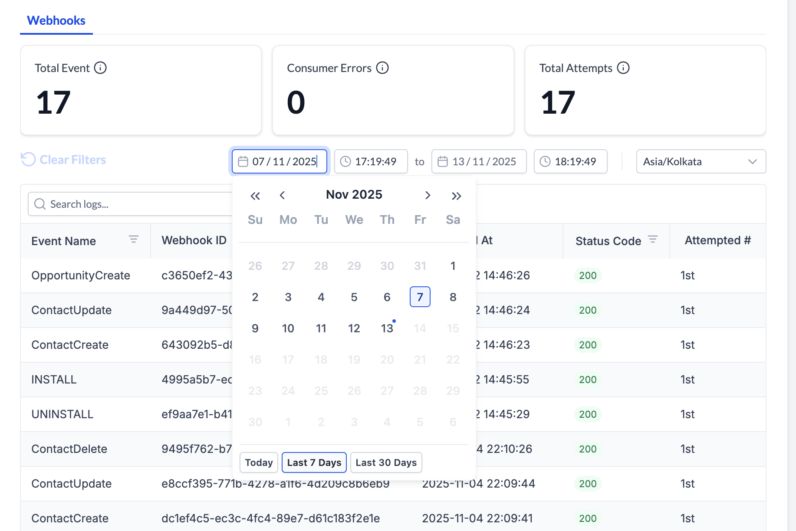
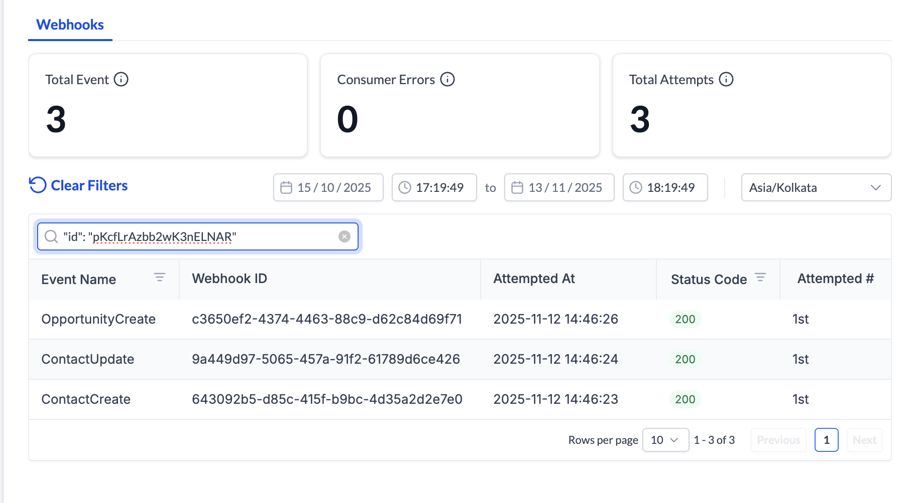
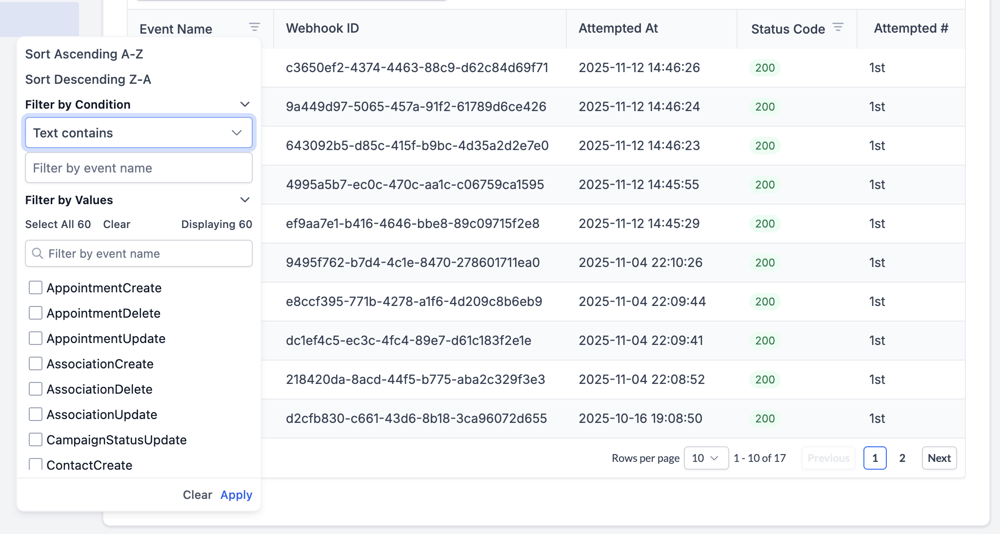
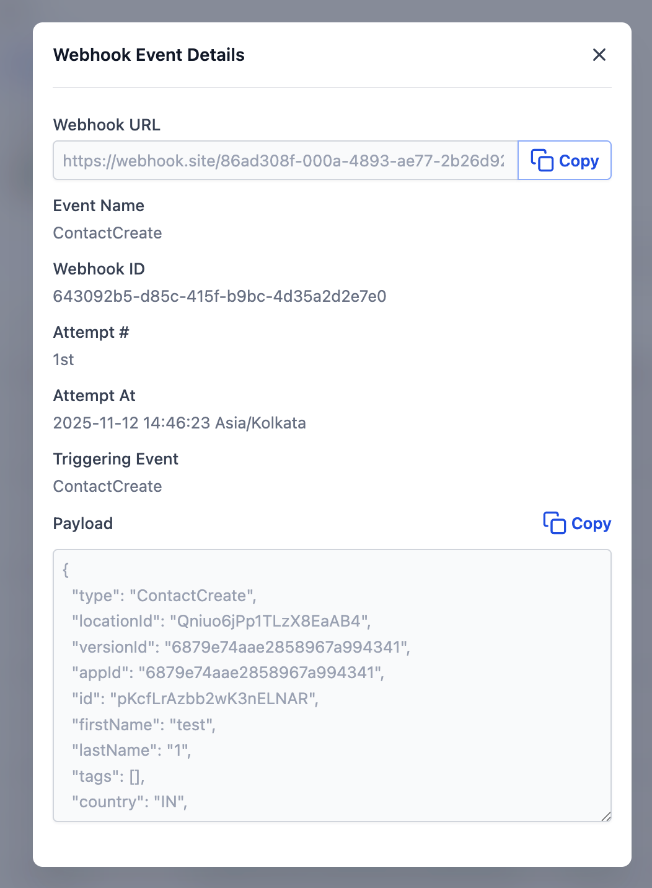

# Webhook Logs Dashboard

Source: https://marketplace.gohighlevel.com/docs/webhook/WebhookLogsDashboard

Screenshot: images/webhook_WebhookLogsDashboard_screenshot.png

## Images

-  (3456x1978, 528.8KB)
-  (1834x1224, 295.2KB)
-  (1814x1004, 189.4KB)
-  (2050x1096, 361.7KB)
-  (1052x1430, 223.4KB)

---

Webhook Logs Dashboard
Webhook Logs Dashboard
The Webhook Logs Dashboard provides comprehensive monitoring and troubleshooting capabilities for webhook deliveries in your marketplace application. This guide covers how to access, navigate, and effectively use the dashboard to monitor your webhook integrations.
Table of Contents
Overview
Accessing Webhook Logs
Understanding the Dashboard
Using Date & Time Filters
Searching Logs
Filtering by Event Name
Filtering by Status Code
Navigating Through Pages
Viewing Webhook Details
Clearing All Filters
Common Use Cases
FAQ
Overview
The Webhook Logs Dashboard enables you to:
View all webhook events sent to your application
Track success and failure rates
Search for specific webhook IDs
Filter by event type and status codes
View detailed payload information
Monitor retry attempts
Work with different timezones
Accessing Webhook Logs
Navigation Steps
Navigate to your Application Dashboard
Click on Select The App You Want Logs For
Select Insights from the left menu
Click on Logs
The Webhooks tab will be active by default
URL Pattern
/app-settings/{your-app-id}/dashboard/logs
Understanding the Dashboard
Statistics Cards
The dashboard displays three key metrics at the top of the page. Important: These statistics show data for the last 24 hours and are independent of your date range filters.
Total Events
Shows the number of unique events received during the selected period
Includes both successful and failed webhooks
Updates based on your selected date range and filters
Deduplicates by webhook ID
Consumer Errors
Displays webhooks that failed (non-2xx status codes)
High numbers indicate potential issues with your webhook endpoint
Total Attempts
Shows all delivery attempts including retries
If this number is higher than Total Events, your app is experiencing retries
Helps identify webhook delivery issues
NOTE: Webhooks are retried with a 10-minute interval (with jitter) for up to 6 attempts when your endpoint returns a 429 status code. For detailed retry policy information, see the Error Handling and Retries section.
Logs Table
The logs table displays the following columns:
Column Description Example
Event Name Type of webhook event ContactCreate, INSTALL
Webhook ID Unique identifier for tracking abc123def456...
Attempted At When the webhook was sent 2024-11-13 14:30:45
Status Code HTTP response status 200 (success) or 404 (error)
Attempt # Delivery attempt number 1st, 2nd, 3rd
Status codes are color-coded: green for success (2xx) and red for errors (all others).
Using Date & Time Filters
Date & Time Pickers
By default, the logs display the last 1 hour of webhook activity
You can change the date range with up to 1 second accuracy for any period within the past 30 days
The date pickers provide quick shortcuts:
Today: Jump to today's date
Last 7 Days: View the past week
Last 30 Days: View the past month (maximum range)
NOTE: Logs are retained for the last 30 days
Changing Timezone
All webhook times are stored in UTC, but you can view them in your local timezone for easier reading.
How to Change Timezone
Locate the timezone dropdown on the right
Click and start typing your timezone (e.g., "America/New_York")
Select your timezone from the list
All times will instantly convert to your selected timezone
Timezone Features
Your selection is saved automatically
All times in the table update immediately
Modal details also display in your selected timezone
Search for timezones by typing
Example:
UTC: 2024-11-13 14:30:00
Eastern Time: 2024-11-13 09:30:00
Searching Logs
Global Search Bar
The search bar is located in the top-left of the table and allows you to search for specific webhooks.
What You Can Search
Webhook ID: Enter the full or partial webhook ID
Webhook Payloads: Enter the value or full key-value pair to search in the payload
How to Search
Click in the search box
To search by webhook ID: Type your webhook ID (e.g., abc123....)
To search by payload: Enter the value or full key-value pair from the payload
Example payload:
{
  "type": "OpportunityCreate",
  "locationId": "3jJ0coeqWCZMAosyGQ6K",
  "versionId": "6878cec452e7c8d29d4dd3d9",
  "appId": "6878cec452e7c8d29d4dd3d9",
  "id": "UHXrFfZGSH5rj7z5rdDP",
  "name": "Test 2",
  "assignedTo": null,
  "contactId": "VQxH1EeoFPg9uhhnCeJx",
  "pipelineId": "WQ7tyljQSXAg7GuTgYdd",
  "pipelineStageId": "403af14e-9afb-40b1-b394-0aa6bbe0cc5e",
  "status": "open",
  "dateAdded": "2025-11-07T12:40:44.510Z",
  "timestamp": "2025-11-07T12:46:45.953Z",
  "webhookId": "881b9415-5d35-4ff1-a667-0545b80b96c0"
}
Any substring of value will work. ex - FPg9uhhnCe (substring from contactId)
Any one key-value pair will work. ex - "contactId": "VQxH1EeoFPg9uhhnCeJx" or name: Test 2 (quotes not important)
random substring of json will not work. ex - sionId": "6878cec452e7c8d29d4dd3d9", "appId": "6878cec452e7c
multiple key values will not work. ex - "appId": "6878cec452e7c8d29d4dd3d9", "id": "UHXrFfZGSH5rj7z5rdDP"
Results will update automatically
Search Features
Search is case-insensitive
Partial matches work (search "abc" finds "abc123def")
Click the X button to clear search
Search works with other filters simultaneously
Filtering by Event Name
Opening the Filter
Find the Event Name column header
Click the filter icon (funnel symbol)
A dropdown menu will appear
Sorting Options
Sort A-Z (Ascending): Click to sort events alphabetically
Sort Z-A (Descending): Click to sort events in reverse order
A blue checkmark indicates the active sort
NOTE: Click on it again to remove the sort
Filter by Condition
Filter event names by text patterns.
Available Conditions
None: No text filtering (default)
Text contains: Show events containing your text
Text does not contain: Exclude events with your text
Text starts with: Show events beginning with your text
Text ends with: Show events ending with your text
Text is exactly: Show only exact matches
How to Use
Click "Filter by Condition" to expand
Select a condition from the dropdown
Type your search text in the input box
Click "Apply" at the bottom
Example:
Condition: "Text starts with"
Input: "Contact"
Result: Shows ContactCreate, ContactUpdate, ContactDelete, ContactDndUpdate & ContactTagUpdate
Filter by Values (Checkboxes)
Select specific event names to view.
How to Use
Click "Filter by Values" to expand
You'll see checkboxes for all available events
Use the search box to filter the checkbox list
Select All: Check all visible events
Clear: Uncheck all events
Select one or more event names
Click "Apply" at the bottom
Clearing Event Name Filters
Click "Clear" button at the bottom of the filter dropdown
Or use the main "Clear Filters" button at the top
Filtering by Status Code
Opening the Filter
Find the Status Code column header
Click the filter icon (funnel symbol)
A dropdown menu will appear
Quick Filter Options
Filter By Success: Click to show only successful webhooks (status codes 200-299)
Filter By Failure: Click to show only failed webhooks (includes all non-2xx status codes: 3xx redirects, 4xx client errors, and 5xx server errors)
A blue checkmark indicates when a filter is active
Note: You can only use one quick filter at a time (Success OR Failure)
Filter by Specific Status Codes
Select exact status codes to view. You can select multiple status codes simultaneously (e.g., 200 and 404) to create custom filter combinations.
How to Use
Click "Filter by Values" to expand
See checkboxes for common HTTP status codes:
Success: 200, 201, 204
Client Errors: 400, 401, 403, 404, 422, 429
Server Errors: 500, 502, 503, 504
Use the search box to find specific codes
Select All: Check all status codes
Clear: Uncheck all
Select the codes you want to see
Click "Apply"
Status Code Colors
Green tag = Success (200-299)
Red tag = Error (all others)
Navigating Through Pages
Pagination Controls
Pagination controls are located at the bottom-right of the table.
Changing Rows Per Page
Locate the "Rows per page" dropdown
Choose from:
10 rows (default)
20 rows
50 rows
Table updates immediately
Moving Between Pages
Using Page Numbers
Click any page number to jump to that page
Current page is highlighted in blue
Shows up to 7 page numbers at a time
Using Previous/Next Buttons
Previous: Go back one page (disabled on first page)
Next: Go forward one page (disabled on last page)
Note: Your filters remain active when you change pages.
Viewing Webhook Details
Opening the Details Modal
Click on any row in the logs table
A modal window will appear with full details
What You'll See
Webhook URL
The endpoint where the webhook was sent
Copy button: Click to copy the URL to your clipboard
Useful for verifying the correct endpoint
Event Information
Event Name: Type of webhook (e.g., ContactCreate)
Webhook ID: Unique identifier for this webhook
Attempt #: Which delivery attempt (1st, 2nd, 3rd, etc.)
Attempted At: When it was sent (in your selected timezone)
Triggering Event: What caused this webhook
Payload
JSON data sent with the webhook
Automatically formatted for easy reading
Copy button: Click to copy entire payload
Useful for:
Debugging issues
Understanding data structure
Testing with sample data
Using the Payload
Copy the Payload
Click the "Copy" button above the payload
Paste into your code editor or testing tool
Use it to reproduce issues locally
Clearing All Filters
When to Clear Filters
You've applied multiple filters and want to start fresh
You're not seeing expected results
You want to view all webhooks in the date range
How to Clear
Locate the "Clear Filters" button (top-left, blue text with refresh icon)
Click the button
All filters are removed instantly
What Gets Cleared
Search text
Event name filters (sort, conditions, selected values)
Status code filters (sort, selected values)
Pagination resets to page 1
What Stays
Date & time range (not cleared)
Timezone selection (not cleared)
Note: The button is only enabled when you have active filters.
Common Use Cases
Use Case 1: Finding a Specific Webhook
Scenario: Support provided a webhook ID to investigate
Steps:
Copy the webhook ID
Paste it in the search bar
Press Enter or wait for auto-search
Click the row to see full details
Use Case 2: Troubleshooting Failed Webhooks
Scenario: Your app isn't receiving webhooks properly
Steps:
Open Status Code filter
Click "Filter By Failure"
Click "Apply"
Review the failed webhooks
Click rows to see error codes and payloads
Look for patterns:
All 404? Your endpoint URL might be wrong
All 401? Check authentication
All 500? Your server has errors
Use Case 3: Checking Retry Behavior
Scenario: You want to see if webhooks are being retried
Steps:
Look at the "Attempt #" column
Search for a specific Webhook ID that appears multiple times
Look for entries like "2nd", "3rd", "4th"
High attempt numbers indicate persistent failures
Click to view details and see what changed between attempts
Use Case 4: Monitoring Event Volume
Scenario: You want to know how many webhooks you're receiving
Steps:
Set date range to "Last 7 Days" or "Last 30 Days"
Look at "Total Events" statistic
Compare to "Total Attempts"
High difference indicates many retries happening
Check "Consumer Errors" to see failure rate
Use Case 5: Focusing on Specific Events
Scenario: You only care about contact-related webhooks
Steps:
Open Event Name filter
Click "Filter by Values"
Type "CONTACT" in the search box
Select all contact events:
ContactCreate
ContactUpdate
ContactDelete
Click "Apply"
Now you only see contact webhooks
Use Case 6: Investigating Issues at Specific Time
Scenario: Your app had issues yesterday at 2 PM
Steps:
Select your timezone first
Set start date/time to yesterday 2:00 PM
Set end date/time to yesterday 3:00 PM
Open Status Code filter
Click "Filter By Failure"
Review what went wrong during that hour
Use Case 7: Comparing Success vs Failure
Scenario: You want to see the success rate
Steps:
Note "Total Events" number
Note "Consumer Errors" number
Calculate: (Total Events - Consumer Errors) / Total Events × 100
Example: (1000 - 50) / 1000 = 95% success rate
Filter by failures to investigate the remaining percentage
Use Case 8: Post-Deployment Verification
Scenario: You just deployed a webhook fix
Steps:
Note the deployment time in your timezone
Set start time to deployment time
Set end time to now
Filter by the event name you fixed
Check "Consumer Errors" should be low/zero
Click rows to verify correct payloads
FAQ
Why is no data showing in the logs?
Why don't the times look right?
I can't find a specific webhook. What should I do?
Why isn't my filter working?
I can't open the details modal. How do I fix this?
Why isn't the copy button working?
Why don't the statistics match my expectations?
Need More Help?
Community: Join our developer community for questions and support
Support: Contact our developer support team for technical assistance
This guide is designed to help you effectively monitor and troubleshoot webhook deliveries. For integration setup and detailed webhook event documentation, please refer to the Webhook Integration Guide and the Complete Webhook Documentation.
Share your feedback
★
★
★
★
★